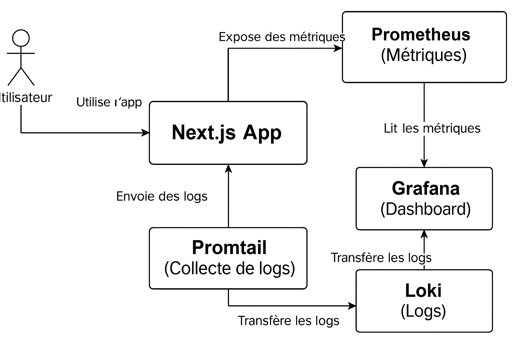

Ce projet [Next.js](https://nextjs.org) est un projet Tailwind crée avec [`create-next-app`](https://nextjs.org/docs/app/api-reference/cli/create-next-app).


# Sommaire

<details>
  <summary>1. Premiers pas
  <ul>
    <li><a href="#1-installation-des-dépendances">Installation des dépendances</a></li>
    <li><a href="#2-lancer-le-serveur-de-développement">Lancer le serveur de développement</a></li>
    <li><a href="#3-pour-lancer-les-tests">Lancer les tests</a></li>
  </ul>
</details>

<details>
  <summary>2. Nomenclature</summary>
  <ul>
    <li><a href="#commit-names">Commit names</a></li>
  </ul>
</details>

<details>
  <summary>3. Accès aux outils</summary>
  <ul>
    <li><a href="#grafana">Grafana</a></li>
    <li><a href="#sonarqube">SonarQube</a></li>
  </ul>
</details>

<details>
  <summary>4. Architecture du projet</summary>
  <ul>
    <li><a href="#architecture-du-projet">Architecture du projet</a></li>
  </ul>
</details>

<details>
  <summary>5. Schéma de l'architecture du projet</summary>
  <ul>
    <li><a href="#schéma-de-larchitecture-du-projet">Schéma de l'architecture du projet</a></li>
  </ul>
</details>

<details>
  <summary>6. Documentation du choix technique</summary>
  <ul>
    <li><a href="#1-pourquoi-nextjs">Pourquoi Next.js ?</a></li>
    <li><a href="#2-pourquoi-tailwind-css">Pourquoi Tailwind CSS ?</a></li>
    <li><a href="#3-pourquoi-docker-et-docker-compose">Pourquoi Docker et Docker Compose ?</a></li>
    <li><a href="#4-pourquoi-prometheus-grafana-loki-et-promtail">Pourquoi Prometheus, Grafana, Loki et Promtail ?</a></li>
    <li><a href="#5-pourquoi-vitest-pour-les-tests">Pourquoi Vitest pour les tests ?</a></li>
    <li><a href="#6-pourquoi-typescript">Pourquoi TypeScript ?</a></li>
  </ul>
</details>


## Premiers pas

### 1. Installation des dépendances

Pour commencer, installe les paquets nécessaires :

```bash
npm install
# ou
npm i
```

Pour en savoir plus, la documentation complète pour l'installation : [`Installation complète`](INSTALLATION.md)

### 2. Lancer le serveur de développement

Pour lancer le serveur:

```bash
npm run dev
# or
yarn dev
# or
pnpm dev
# or
bun dev
```

### 3. Pour lancer les tests

Pour exécuter les tests:

```bash
npm run test
```

Open [http://localhost:3000](http://localhost:3000) with your browser to see the result.

You can start editing the page by modifying `app/page.tsx`. The page auto-updates as you edit the file.


## Nomentclatures

### Commit names

For new files, functions, or anything else that is new to the project :

```
Add : ............ .... .......
```

For updates on files, functions or anything else that changed in the project :

```
Update : ............ .... .......
```

For deletes on files, functions, or anything else that has been removed to the the project :

```
Delete : ............ .... .......
```

## Accès aux outils

### Grafana

Id : admin

Password : admin


### SonarCube

SonarCube
Id : admin
password : Tg8#plmWz9eD


## Architecture du projet 

Ce projet utilise du Next.js, il comporte plusieurs dossiers :

- `/app` : contient les pages de l’application
- `/components`: composants réutilisables
- `/grafana`: contient la configuration de Grafana pour avoir une visualisation des données.
- `/loki`: contient la configuration pour l'intégration de Loki, permettant la collecte et la gestion des logs. Les logs collectés sont envoyés à Grafana pour une visualisation centralisée.
- `/prometheus`: contient la configuration pour Prometheus, qui est utilisé afin de collecter les métriques de performance de l'application. Ces métriques seront visible via Grafana.
- `/promtail` : contient la configuration de Promtail, un agent de collecte de logs qui envoie les logs à Loki pour leur traitement et leur visualisation.
- `/styles` : styles globaux et utilitaires
- `/tests` : tests unitaires
- `/public` : ressources publiques (images, fichiers statiques)
- `docker-compose.yaml`: fichier de configuration pour Docker Compose, permettant de déployer et gérer l'orchestration des conteneurs (par exemple, Prometheus, Grafana, Loki).
- `Dockerfile` : image Docker pour le déploiement
- `promtail-config.yaml`: fichier de configuration pour Promtail, définissant la collecte et l'envoi des logs à Loki.
- `setupTests.ts` : fichier de configuration pour initialiser les tests unitaires avec Vitest.
- `tsconfig.js` : fichier de configuration TypeScript pour la compilation du projet.
- `vitest.config.ts` : configuration des tests
- `sonar-project.properties`:configuration utilisé par SonarQube ou SonarCloud pour analyser le code du projet


## Documentation du choix technique

| **Outil/Technologie**           | **Rôle**                                                                                             |
|---------------------------------|------------------------------------------------------------------------------------------------------|
| **Next.js** 🖥️                  | Framework principal pour le développement d'applications React avec rendu côté serveur (SSR) et génération statique (SSG). |
| **Tailwind CSS** 🎨             | Framework CSS utilitaire pour une personnalisation rapide et un design réactif.                      |
| **Docker** 🐳                   | Outil pour créer, déployer et exécuter des applications dans des conteneurs, assurant l'isolation de l'environnement. |
| **Docker Compose** 🔧           | Outil pour gérer plusieurs conteneurs Docker, permettant d'orchestrer les services comme Prometheus et Grafana. |
| **Prometheus** 📊               | Outil de surveillance open-source pour collecter et analyser des métriques de performance en temps réel. |
| **Grafana** 📈                  | Outil de visualisation de données collectées par Prometheus, permettant la création de dashboards. |
| **Loki** 🔍                     | Système de gestion des logs pour stocker et indexer les logs d'application, facilitant leur recherche. |
| **Promtail** 📦                 | Agent qui collecte et envoie les logs vers Loki pour leur traitement et visualisation.               |
| **Vitest** ✅                   | Framework de test unitaire et d'intégration rapide et moderne pour JavaScript/TypeScript.              |
| **TypeScript** 🅾️              | Sur-ensemble de JavaScript offrant un typage statique pour améliorer la robustesse et la maintenabilité du code. |
| **SonarQube** 🦑                | Outil d'analyse de code pour détecter les bugs, vulnérabilités et mauvaises pratiques dans le code.     |

| **SonarCloud** ☁️              | Accès à SonarCloud pour analyser le code dans le cloud.                   |
| **Vitest.config.ts** ⚙️        | Fichier de configuration des tests unitaires avec Vitest.                                           |
| **tsconfig.js** ⚡             | Fichier de configuration TypeScript pour la compilation du projet.                                   |

## Schéma de l'architecture du projet 




### 1. **Pourquoi Next.js ?**

Next.js a été choisi comme framework principal pour ce projet en raison de sa capacité à fournir une solution complète pour le développement d'applications React. Voici quelques raisons clés pour lesquelles nous avons opté pour Next.js :

- **Rendu côté serveur (SSR) et génération statique (SSG)** : Next.js permet de générer des pages statiques à la compilation ou de rendre des pages côté serveur lors des requêtes. Cela améliore la performance des pages et permet un meilleur référencement SEO.
  
- **Optimisation automatique** : Next.js s'occupe de l'optimisation des performances pour vous. Il divise automatiquement votre code en plus petits morceaux (code-splitting), ce qui réduit la taille des fichiers et accélère le temps de chargement des pages.
  
- **Système de routage intégré** : Next.js utilise un système de routage basé sur le système de fichiers, ce qui simplifie la gestion des pages sans nécessiter de configuration supplémentaire.

- **API Routes** : Next.js permet également de gérer des routes API dans le même projet, ce qui évite la nécessité d'un backend séparé pour des tâches simples comme la gestion des données utilisateur.

### 2. **Pourquoi Tailwind CSS ?**

Pour la gestion du design, nous avons opté pour **Tailwind CSS**, un framework CSS utilitaire qui offre une grande flexibilité tout en permettant une productivité élevée :

- **Personnalisation facile** : Contrairement aux frameworks traditionnels, Tailwind permet une personnalisation fine sans avoir à écraser des styles prédéfinis. Les classes utilitaires sont directement appliquées dans le code HTML ou JSX, ce qui permet de modifier les styles de manière très précise.
  
- **Réduction du CSS inutilisé** : Tailwind est conçu pour être purgé de tout code CSS inutile en production, ce qui permet de maintenir une taille de fichier CSS minimale.
  
- **Rapidité et cohérence** : Avec ses classes utilitaires, Tailwind permet de créer rapidement des interfaces cohérentes et réactives sans avoir besoin d'écrire de longues feuilles de style.

### 3. **Pourquoi Docker et Docker Compose ?**

Nous avons choisi Docker et Docker Compose pour gérer l'environnement de développement et le déploiement. Ces outils permettent de garantir que l'application fonctionne de manière identique sur toutes les machines, de la machine de développement à la production.

- **Isolation de l'environnement** : Docker permet de déployer l'application dans un conteneur isolé, garantissant que toutes les dépendances (comme Node.js, Prometheus, Grafana, etc.) soient bien isolées et facilement reproductibles.
  
- **Déploiement simplifié avec Docker Compose** : Docker Compose permet de définir et gérer les services liés à l'application (comme les services de monitoring avec Prometheus et Grafana) en une seule commande. Cela simplifie le déploiement, même pour des environnements complexes, en automatisant la configuration des services.

### 4. **Pourquoi Prometheus, Grafana, Loki et Promtail ?**

Ce projet inclut des outils de monitoring et de gestion des logs afin d'assurer une visibilité complète sur les performances de l'application. Voici un aperçu de chaque outil et son rôle :

- **Prometheus** : Un système de surveillance open-source permettant de collecter, stocker et analyser des métriques sur l'application. Prometheus permet de suivre en temps réel des métriques comme le temps de réponse, le taux d'erreurs, etc., ce qui aide à maintenir des performances optimales.
  
- **Grafana** : Un outil de visualisation des données collectées par Prometheus. Grafana permet de créer des dashboards interactifs et visuels pour analyser les données en temps réel, ce qui aide les développeurs et les administrateurs à comprendre les performances de l'application et à identifier des problèmes potentiels.
  
- **Loki** : Un système de gestion des logs. Contrairement à Prometheus, qui est dédié aux métriques, Loki est conçu pour stocker et indexer les logs d'application. Cela permet de rechercher rapidement dans les logs et de corréler les événements avec les métriques collectées.
  
- **Promtail** : Un agent qui collecte les logs d'application et les envoie vers Loki. Promtail aide à centraliser et gérer les logs dans un environnement de production, tout en permettant une recherche efficace des événements.

### 5. **Pourquoi Vitest pour les tests ?**

Pour les tests unitaires et d'intégration, nous avons opté pour **Vitest**, un framework de test moderne et rapide pour les projets JavaScript/TypeScript.

- **Rapidité** : Vitest est optimisé pour être extrêmement rapide, en particulier pour les tests qui nécessitent de fréquentes exécutions pendant le développement.
  
- **Compatibilité avec Jest** : Vitest est largement compatible avec Jest, ce qui permet une migration facile pour les équipes ayant déjà utilisé Jest pour les tests.
  
- **Intégration facile avec Vite** : Comme ce projet utilise Next.js, qui fonctionne de manière optimale avec Vite, Vitest s'intègre facilement et permet de réaliser des tests en utilisant des fonctionnalités comme le hot-reloading, ce qui améliore la productivité des développeurs.

### 6. **Pourquoi TypeScript ?**

Le projet utilise **TypeScript**, un sur-ensemble typé de JavaScript, pour améliorer la robustesse et la maintenabilité du code.

- **Vérification de types statiques** : TypeScript aide à détecter les erreurs de type avant l'exécution, réduisant ainsi le nombre de bugs pendant le développement.
  
- **Meilleure autocomplétion et refactorisation** : TypeScript offre une meilleure prise en charge des outils d'autocomplétion et facilite la refactorisation du code, ce qui est particulièrement utile pour les équipes de développement travaillant sur un codebase important.
  
- **Support des fonctionnalités modernes** : TypeScript permet d'utiliser des fonctionnalités modernes de JavaScript tout en garantissant la compatibilité avec les navigateurs plus anciens.


